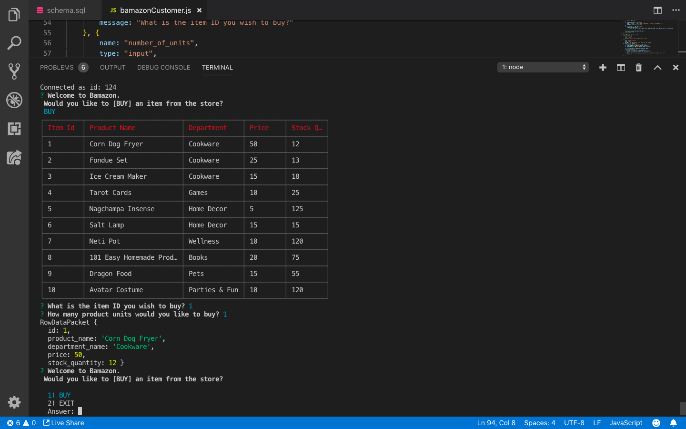

# Bamazon

Bamazon is  a simple node application that allows customers to purchase products. The app starts by asking the user if they would like to purchase products from Bamazon. They are initially prompted with the option to buy or exit the application.

If the customer chooses to buy, a table appears with the current products available along with their price and the available stock. 

The customer is then asked to choose the product they would like to purchase as well as the quantity. 

If inventory is insufficient to fulfill the customer request, a message will appear explaining lack of stock available and the customer will be asked to choose a different item.

If the inventory is available the customers purchase is confirmed and the inventory is updated. 
